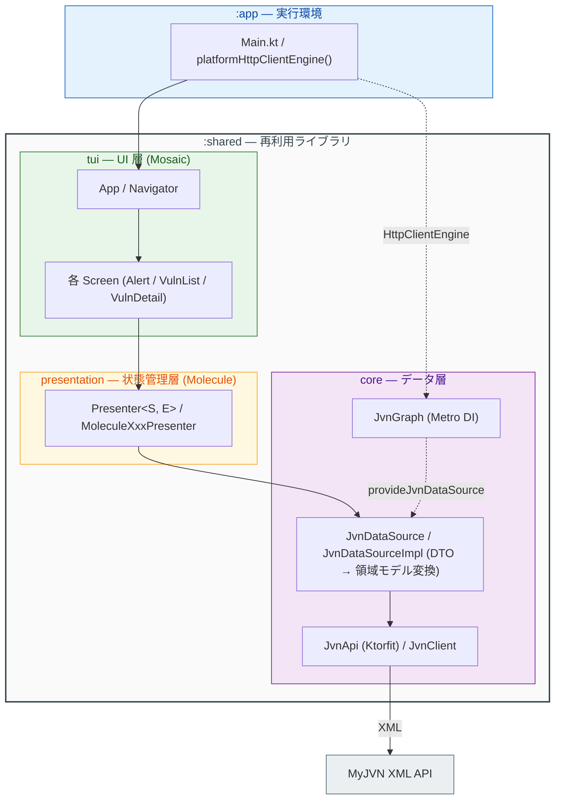

# Architecture Rules

MyJVN API (`https://jvndb.jvn.jp/`) から脆弱性情報・注意警戒情報を取得して表示する TUI アプリケーションのアーキテクチャ指針。
Kotlin Multiplatform (KMP) で JVM / Linux (x64) / macOS (arm64) / Windows (mingwX64) 向けにビルドする。

## モジュール構成

- **`:shared`** — 再利用ライブラリ。ネットワーク・データ変換・状態管理・TUI 描画のすべてを含む。公開 API の可視性・型を明示し、実装詳細は `internal` にする。
- **`:app`** — 実行可能バイナリ。エントリポイント ([Main.kt](../../app/src/commonMain/kotlin/com/github/casl0/jvncli/Main.kt)) と**プラットフォームごとの HTTP エンジン選択のみ**を担う。

## データフロー

データは一方向に流れる: **TUI (Mosaic) → Presenter (Molecule) → JvnDataSource → JvnApi (Ktorfit) → MyJVN XML API**。

実線がデータの流れ、点線が DI による注入 (`Main` が `HttpClientEngine` を渡し、`provideJvnDataSource` が `JvnDataSource` を供給する) を表す。

### `core` — データ層 (`shared/.../core/`)

- **`network/`** — `JvnApi` は Ktorfit の `@GET("myjvn")` インターフェース。MyJVN は単一エンドポイントで、`method` クエリパラメータ (`getAlertList` 等) で API を切り替える。レスポンスは XML で、`JvnClient` が xmlutil + ContentNegotiation で DTO へデコードする (`ignoreUnknownChildren`)。`model/` に XML DTO を置く。
- **`datasource/`** — `JvnDataSource` (公開 interface) と `JvnDataSourceImpl` (`internal`)。**DTO → 領域モデルへの変換はここに集約**し、`private fun XxxDto.toXxx()` 拡張関数で行う。共通ヘルパー `fetch()` が retCd 判定と例外処理を一元化する。
- **`model/`** — 上位レイヤへ公開する領域モデル (`Alert`, `VulnOverview` 等)。
- **`JvnResult`** — API 結果を `Success` / `ApiError` (retCd != 0) / `NetworkError` (通信・解析失敗) の sealed interface で区別する。呼び出し側は `when` で網羅する。
- **`di/`** — Metro による DI グラフ `JvnGraph` (`internal`)。公開エントリは `provideJvnDataSource(engine)` のみ。

### `presentation` — 状態管理層 (`shared/.../presentation/`)

- Molecule ベースの Presenter パターン。`Presenter<S, E>` interface が状態型 `S` (`StateFlow`) とイベント型 `E` を持つ。
- 画面ごとに `presenter/` (Molecule `@Composable` 本体 + `MoleculeXxxPresenter` 実装)、`event/`、`state/` を分ける。
- `providePresenters(engine, scope)` が `provideJvnDataSource` からデータ層を取得して Presenter 群を組み立てる。
- Presenter テストは Turbine で `launchMolecule` の `StateFlow` をアサートする。

### `tui` — UI 層 (`shared/.../tui/`)

- Jakewharton Mosaic による端末描画。`runJvnTui(engine)` が起動エントリ (`runMosaic` を隠蔽)。
- `navigation/` の `Navigator` が自前ルーティング (ルーティングライブラリ不使用)。`Screen` sealed で現在画面を表す。
- `ui/` に各画面 (`AlertScreen` 等) と共通コンポーネント (`ScrollableList`, `TabBar`, `Border`)。キーイベントは各 Screen が処理し、未処理キーは親 (`App`) へ伝播してタブ切替 (Tab) / 戻る (Esc) になる。

### HTTP エンジンの注入境界

エンジン選択は **実行環境 (`app` モジュール) の責務**。`shared` は `HttpClientEngine` を外部から受け取るだけで、特定エンジンに依存しない。
`app` は expect/actual (`platformHttpClientEngine()`) で JVM/Linux/macOS に **CIO**、Windows に **WinHttp** を選ぶ (CIO が Windows 非対応のため)。
テストでは `MockEngine` を注入する。

## MyJVN API を追加するときの流れ

1. `JvnApi` に `@GET("myjvn")` メソッドを追記 (`method` を固定値のデフォルト引数にする)。
2. `network/model/` にレスポンス XML の DTO を追加 (`@Serializable`、nullable は XSD の `minOccurs`/`use` に整合させる)。
3. `model/` に領域モデルを追加。
4. `JvnDataSource` に suspend 関数を追記し、`JvnDataSourceImpl` で `fetch()` を使って実装 (`toXxx()` 変換を書く)。
5. 必要なら `presentation` / `tui` に画面を追加。
6. `shared/src/commonTest/` にフィクスチャ XML とテストを追加 (カバレッジ 80% 下限あり)。
